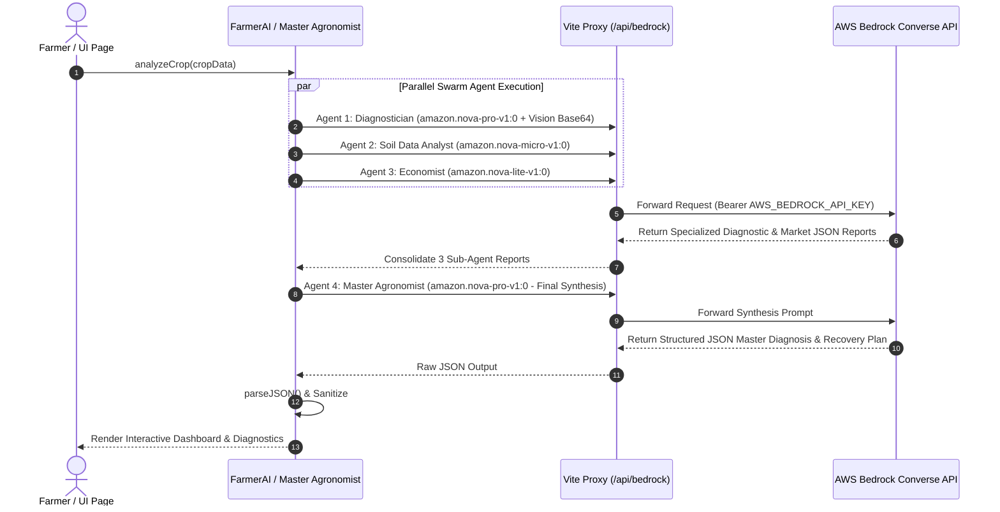
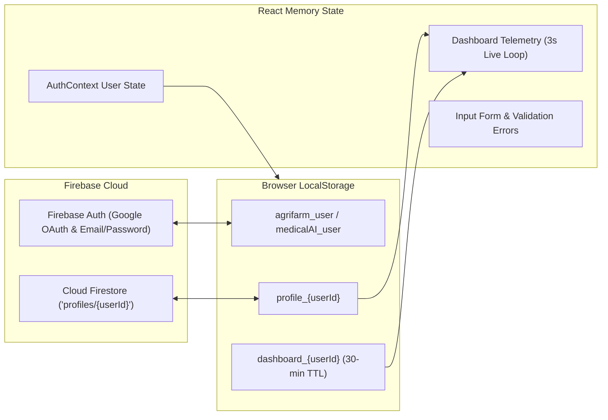

# AgriFarmAI Codebase Memory Graph & System Analysis

## Executive Summary

**AgriFarmAI** (`harsh_hackthon_project`) is an enterprise-grade, multi-agent AI-powered precision agriculture platform built with **Vite + React (v19)**, **Tailwind CSS**, **Framer Motion**, and **Firebase**. The platform connects farmers, agronomists, and agricultural enterprises with autonomous AI agents (Diagnostician, Soil Chemist, Data Analyst, Market Economist, Master Agronomist) powered by AWS Bedrock (Amazon Nova models).

---

## High-Level Architecture & Dependency Memory Graph

```mermaid
graph TD
    subgraph EntryPoint ["Entry & Configuration"]
        Main["[main.jsx](file:///d:/Projects/Web%20Projects/Harsh/harsh_hackthon_project/src/main.jsx)"]
        App["[App.jsx](file:///d:/Projects/Web%20Projects/Harsh/harsh_hackthon_project/src/App.jsx)"]
        Router["React Router v7"]
        i18n["[i18n.js](file:///d:/Projects/Web%20Projects/Harsh/harsh_hackthon_project/src/i18n.js)"]
    end

    subgraph StateAndContext ["State Management & Security"]
        AuthContext["[AuthContext.jsx](file:///d:/Projects/Web%20Projects/Harsh/harsh_hackthon_project/src/context/AuthContext.jsx)"]
        Sanitize["[sanitize.js](file:///d:/Projects/Web%20Projects/Harsh/harsh_hackthon_project/src/utils/sanitize.js)"]
        Validation["[validationLimits.js](file:///d:/Projects/Web%20Projects/Harsh/harsh_hackthon_project/src/utils/validationLimits.js)"]
        SecurityConfig["[security.js](file:///d:/Projects/Web%20Projects/Harsh/harsh_hackthon_project/src/config/security.js)"]
        DevToolsBlocker["[devToolsBlocker.js](file:///d:/Projects/Web%20Projects/Harsh/harsh_hackthon_project/src/utils/devToolsBlocker.js)"]
    end

    subgraph ServicesLayer ["Services & AI Swarm Orchestration"]
        BaseAI["[baseAI.js](file:///d:/Projects/Web%20Projects/Harsh/harsh_hackthon_project/src/services/baseAI.js)"]
        FarmerAI["[huggingFaceService.js](file:///d:/Projects/Web%20Projects/Harsh/harsh_hackthon_project/src/services/huggingFaceService.js)"]
        CropHealthSvc["[cropHealthService.js](file:///d:/Projects/Web%20Projects/Harsh/harsh_hackthon_project/src/services/cropHealthService.js)"]
        SciCropSvc["[scientificCropService.js](file:///d:/Projects/Web%20Projects/Harsh/harsh_hackthon_project/src/services/scientificCropService.js)"]
        AlphaVantageSvc["[alphaVantageService.js](file:///d:/Projects/Web%20Projects/Harsh/harsh_hackthon_project/src/services/alphaVantageService.js)"]
        MedicalAI["[medicalAI.js](file:///d:/Projects/Web%20Projects/Harsh/harsh_hackthon_project/src/services/medicalAI.js)"]
        ProfileSvc["[profileService.js](file:///d:/Projects/Web%20Projects/Harsh/harsh_hackthon_project/src/services/profileService.js)"]
        FirebaseSvc["[firebase.js](file:///d:/Projects/Web%20Projects/Harsh/harsh_hackthon_project/src/services/firebase.js)"]
    end

    subgraph UserInterface ["UI Components & Pages"]
        Home["[Home.jsx](file:///d:/Projects/Web%20Projects/Harsh/harsh_hackthon_project/src/pages/Home.jsx)"]
        Dashboard["[Dashboard.jsx](file:///d:/Projects/Web%20Projects/Harsh/harsh_hackthon_project/src/pages/Dashboard.jsx)"]
        ProfileSetup["[ProfileSetup.jsx](file:///d:/Projects/Web%20Projects/Harsh/harsh_hackthon_project/src/pages/ProfileSetup.jsx)"]
        CropHealthPage["[CropHealth.jsx](file:///d:/Projects/Web%20Projects/Harsh/harsh_hackthon_project/src/pages/CropHealth.jsx)"]
        SoilAnalysisPage["[SoilAnalysis.jsx](file:///d:/Projects/Web%20Projects/Harsh/harsh_hackthon_project/src/pages/SoilAnalysis.jsx)"]
        GeoSoilPage["[GeoSoilAnalysis.jsx](file:///d:/Projects/Web%20Projects/Harsh/harsh_hackthon_project/src/pages/GeoSoilAnalysis.jsx)"]
        MonitoringPage["[Monitoring.jsx](file:///d:/Projects/Web%20Projects/Harsh/harsh_hackthon_project/src/pages/Monitoring.jsx)"]
        MarketIntelPage["[MarketIntel.jsx](file:///d:/Projects/Web%20Projects/Harsh/harsh_hackthon_project/src/pages/MarketIntel.jsx)"]
        AIAnalyticsPage["[AIAnalytics.jsx](file:///d:/Projects/Web%20Projects/Harsh/harsh_hackthon_project/src/pages/AIAnalytics.jsx)"]
        AnalysisPage["[Analysis.jsx](file:///d:/Projects/Web%20Projects/Harsh/harsh_hackthon_project/src/pages/Analysis.jsx)"]
        InsightsPage["[Insights.jsx](file:///d:/Projects/Web%20Projects/Harsh/harsh_hackthon_project/src/pages/Insights.jsx)"]
        AboutPage["[About.jsx](file:///d:/Projects/Web%20Projects/Harsh/harsh_hackthon_project/src/pages/About.jsx)"]
        ContactPage["[Contact.jsx](file:///d:/Projects/Web%20Projects/Harsh/harsh_hackthon_project/src/pages/Contact.jsx)"]
        LoginPage["[Login.jsx](file:///d:/Projects/Web%20Projects/Harsh/harsh_hackthon_project/src/pages/Login.jsx)"]
        
        CustomDropdown["[CustomDropdown.jsx](file:///d:/Projects/Web%20Projects/Harsh/harsh_hackthon_project/src/components/CustomDropdown.jsx)"]
        FarmingTool["[FarmingTool.jsx](file:///d:/Projects/Web%20Projects/Harsh/harsh_hackthon_project/src/components/FarmingTool.jsx)"]
        GrowingGuideTab["[GrowingGuideTab.jsx](file:///d:/Projects/Web%20Projects/Harsh/harsh_hackthon_project/src/components/GrowingGuideTab.jsx)"]
        LanguageSwitcher["[LanguageSwitcher.jsx](file:///d:/Projects/Web%20Projects/Harsh/harsh_hackthon_project/src/components/LanguageSwitcher.jsx)"]
        ProtectedRoute["[ProtectedRoute.jsx](file:///d:/Projects/Web%20Projects/Harsh/harsh_hackthon_project/src/components/ProtectedRoute.jsx)"]
    end

    Main --> App
    Main --> i18n
    App --> AuthContext
    App --> Router
    Router --> Home
    Router --> Dashboard
    Router --> CropHealthPage
    Router --> SoilAnalysisPage
    Router --> GeoSoilPage
    Router --> MonitoringPage
    Router --> MarketIntelPage
    Router --> ProfileSetup
    Router --> LoginPage
    Router --> AboutPage
    Router --> ContactPage
    Router --> FarmingTool
    Router --> AIAnalyticsPage
    Router --> AnalysisPage
    Router --> InsightsPage

    CropHealthPage --> FarmerAI
    SoilAnalysisPage --> FarmerAI
    GeoSoilPage --> FarmerAI
    MonitoringPage --> FarmerAI
    MarketIntelPage --> FarmerAI
    MarketIntelPage --> AlphaVantageSvc
    Dashboard --> FarmerAI
    Dashboard --> ProfileSvc
    Dashboard --> GrowingGuideTab
    ProfileSetup --> ProfileSvc
    ProfileSetup --> FarmerAI
    LoginPage --> FirebaseSvc
    LoginPage --> ProfileSvc

    FarmerAI -- inherits --> BaseAI
    CropHealthSvc -- inherits --> BaseAI
    SciCropSvc -- inherits --> BaseAI
    MedicalAI -- inherits --> BaseAI
    AlphaVantageSvc --> BaseAI
    FarmerAI --> Sanitize
```

---

## AWS Bedrock Multi-Agent Parallel Swarm Memory Graph

---

## Detailed File-by-File Memory Node Mapping

### 1. Root & Infrastructure Layer

| File Path | Primary Function & Responsibilities | Key Dependencies & Exports |
| :--- | :--- | :--- |
| [`package.json`](file:///d:/Projects/Web%20Projects/Harsh/harsh_hackthon_project/package.json) | Project manifest, npm scripts (`dev`, `build`, `build:secure`, `security:audit`), and dependencies (`react@19`, `firebase@12`, `framer-motion@12`, `i18next`, `lucide-react`, `ogl`, `tailwindcss@3`). | Core configurations & script shortcuts |
| [`vite.config.js`](file:///d:/Projects/Web%20Projects/Harsh/harsh_hackthon_project/vite.config.js) | Vite bundler config with HTTP security headers (`X-Content-Type-Options`, `X-Frame-Options`, `X-XSS-Protection`), Rollup manual chunking for vendor React/Router/i18n, Terser compression (console drop), and AWS Bedrock API proxy rewrite (`/api/bedrock` -> `https://bedrock-runtime.us-east-1.amazonaws.com`). | Export default Vite config |
| [`eslint.config.js`](file:///d:/Projects/Web%20Projects/Harsh/harsh_hackthon_project/eslint.config.js) | ESLint v9 configuration setup for React 19 JSX and hooks. | ESLint standard config |
| [`postcss.config.js`](file:///d:/Projects/Web%20Projects/Harsh/harsh_hackthon_project/postcss.config.js) | PostCSS configuration binding TailwindCSS and Autoprefixer. | Export PostCSS plugins |
| [`tailwind.config.js`](file:///d:/Projects/Web%20Projects/Harsh/harsh_hackthon_project/tailwind.config.js) | Tailwind CSS v3 configuration defining content paths and custom theme extensions. | Export Tailwind config |
| [`index.html`](file:///d:/Projects/Web%20Projects/Harsh/harsh_hackthon_project/index.html) | HTML5 entry point with viewport configuration, title, and root mounting point `#root`. | Entry point document |
| [`scripts/build-secure.js`](file:///d:/Projects/Web%20Projects/Harsh/harsh_hackthon_project/scripts/build-secure.js) | Hardened production build runner: backs up `.env`, verifies path traversal, builds `dist`, scans output JS files for leaked API keys (`hf_`, `sk-`), and restores `.env`. | Node CLI build script |

---

### 2. Core Application Layer (`src/`)

| File Path | Primary Function & Responsibilities | Key Dependencies & Exports |
| :--- | :--- | :--- |
| [`src/main.jsx`](file:///d:/Projects/Web%20Projects/Harsh/harsh_hackthon_project/src/main.jsx) | React entry file. Mounts `<App />` within `StrictMode`, imports `index.css` and `i18n.js`. | React root render |
| [`src/App.jsx`](file:///d:/Projects/Web%20Projects/Harsh/harsh_hackthon_project/src/App.jsx) | Main Router component. Sets up `BrowserRouter`, `AuthProvider`, and 13 page routes (`/`, `/dashboard`, `/crop-health`, `/soil-analysis`, `/geo-soil-analysis`, `/monitoring`, `/market-intel`, `/profile-setup`, `/farming-tool`, `/ai-analytics`, `/analysis`, `/insights`, `/about`, `/contact`, `/login`). | `export default App` |
| [`src/i18n.js`](file:///d:/Projects/Web%20Projects/Harsh/harsh_hackthon_project/src/i18n.js) | Internationalization configuration initializing `i18next` with English (`en`) and Hindi (`hi`) translation resources and browser language detection. | Export `i18n` instance |
| [`src/index.css`](file:///d:/Projects/Web%20Projects/Harsh/harsh_hackthon_project/src/index.css) | Global stylesheet importing Tailwind directives (`@tailwind base; components; utilities;`), scrollbar styles, and custom font definitions. | Global CSS |
| [`src/App.css`](file:///d:/Projects/Web%20Projects/Harsh/harsh_hackthon_project/src/App.css) | Custom animations and application-specific utility styles (e.g., custom glow effects, spin-slow, pulse effects). | CSS rules |

---

### 3. Context, Config & Utilities Layer

| File Path | Primary Function & Responsibilities | Key Exports |
| :--- | :--- | :--- |
| [`src/context/AuthContext.jsx`](file:///d:/Projects/Web%20Projects/Harsh/harsh_hackthon_project/src/context/AuthContext.jsx) | Authentication React Context provider managing user authentication state (`user`, `login`, `signup`, `logout`) with LocalStorage backup (`medicalAI_user`). | `AuthProvider`, `useAuth` |
| [`src/config/security.js`](file:///d:/Projects/Web%20Projects/Harsh/harsh_hackthon_project/src/config/security.js) | Defines `SECURITY_CONFIG` (Max input length 1000, 5MB file limit, allowed document mime types, API rate limits, Content Security Policy directives) and validation functions (`validateFileType`, `validateFileSize`, `validateInput`). | `SECURITY_CONFIG`, validator functions |
| [`src/utils/sanitize.js`](file:///d:/Projects/Web%20Projects/Harsh/harsh_hackthon_project/src/utils/sanitize.js) | XSS prevention & input sanitization utilities (`sanitizeInput` removes `<script>` tags, HTML tags, `javascript:` protocols, event handlers; `sanitizeObject` recursively cleans object values; `escapeHtml`). | `sanitizeInput`, `sanitizeObject`, `escapeHtml` |
| [`src/utils/validationLimits.js`](file:///d:/Projects/Web%20Projects/Harsh/harsh_hackthon_project/src/utils/validationLimits.js) | Agricultural numeric and text range limits (`VALIDATION_LIMITS` for soil pH 0-14, moisture 0-100%, NPK 0-1000ppm, field size, monitoring sensors) and `validateInput(value, fieldName, category)` helper. | `VALIDATION_LIMITS`, `validateInput`, `getFieldLimits` |
| [`src/utils/devToolsBlocker.js`](file:///d:/Projects/Web%20Projects/Harsh/harsh_hackthon_project/src/utils/devToolsBlocker.js) | Security utility that disables context menu right-clicking, F12 / DevTools hotkeys, text selection, and monitors inner/outer window dimension deltas to block browser inspector access. | `initDevToolsBlocker` |

---

### 4. AI Services & Backend Infrastructure Layer (`src/services/`)

| File Path | Primary Function & Responsibilities | Key Model / API Integrations |
| :--- | :--- | :--- |
| [`src/services/baseAI.js`](file:///d:/Projects/Web%20Projects/Harsh/harsh_hackthon_project/src/services/baseAI.js) | Foundation class `BaseAI` for all AI agents. Map model string names to AWS Bedrock models (`amazon.nova-pro-v1:0`, `amazon.nova-micro-v1:0`, `amazon.nova-lite-v1:0`). Executes HTTP POST requests to `/api/bedrock/model/{model}/converse` with 150s abort timeout, multi-modal image bytes payload formatting, and robust multi-regex JSON extraction (`parseJSON`). | Base class `BaseAI` |
| [`src/services/huggingFaceService.js`](file:///d:/Projects/Web%20Projects/Harsh/harsh_hackthon_project/src/services/huggingFaceService.js) | Primary AI engine class `FarmerAI` extending `BaseAI`. Orchestrates parallel multi-agent swarms:  - `analyzeCrop`: Diagnostician (Nova Pro Vision) + Data Analyst (Nova Micro) + Economist (Nova Lite) -> Master Agronomist (Nova Pro synthesis) - `analyzeSoil`: Chemist (Nova Micro) + Economist (Nova Lite) -> Master Agronomist synthesis - `analyzeMarketConditions`: Data Analyst + Economist -> Chief Market Officer synthesis - `optimizeIrrigation`: IoT precision scheduler - Includes full fallback datasets with `FALLBACK_DISCLAIMER`. | Class `FarmerAI` |
| [`src/services/scientificCropService.js`](file:///d:/Projects/Web%20Projects/Harsh/harsh_hackthon_project/src/services/scientificCropService.js) | Deterministic agricultural science engine `ScientificCropService` calculating exact crop-specific NPK fertilizer doses per acre (Rice, Wheat, Maize, Tomato, Cotton), organic manure quantities, MOP/Urea dosages, and recovery timelines without external API calls. | Class `ScientificCropService` |
| [`src/services/cropHealthService.js`](file:///d:/Projects/Web%20Projects/Harsh/harsh_hackthon_project/src/services/cropHealthService.js) | Multi-step plant disease diagnostic service `CropHealthService` breaking diagnosis into 5 sequential steps: Symptom Analysis -> Disease Identification -> Severity Assessment -> Treatment Calculation -> Final Report Generation. | Class `CropHealthService` |
| [`src/services/alphaVantageService.js`](file:///d:/Projects/Web%20Projects/Harsh/harsh_hackthon_project/src/services/alphaVantageService.js) | Financial commodity market simulator & price predictor `AlphaVantageService`. Generates Alpha Vantage Global Quote formatted responses for agricultural symbols (CORN, SOYB, WEAT, CANE, RICE), tracks market sentiment, top gainers/losers, and calculates price projections. | Class `AlphaVantageService` |
| [`src/services/medicalAI.js`](file:///d:/Projects/Web%20Projects/Harsh/harsh_hackthon_project/src/services/medicalAI.js) | Comprehensive health & vitals AI diagnostic class `MedicalAI` providing clinical diagnosis, vitals evaluation (blood pressure, heart rate, SpO2), health risk predictions, and trend trajectories. | Class `MedicalAI` |
| [`src/services/profileService.js`](file:///d:/Projects/Web%20Projects/Harsh/harsh_hackthon_project/src/services/profileService.js) | Firebase Firestore + LocalStorage dual-tier persistence manager (`saveProfile`, `getProfile`, `checkProfileCompleted`). Ensures zero offline data loss by saving locally before attempting Firestore syncing. | `saveProfile`, `getProfile`, `checkProfileCompleted` |
| [`src/services/firebase.js`](file:///d:/Projects/Web%20Projects/Harsh/harsh_hackthon_project/src/services/firebase.js) | Initializes Firebase App, Auth, Firestore (`db`), and Google Auth Provider (`googleProvider`). Exposes helper functions for Google popup sign-in, email signup, email sign-in, and sign-out. | `auth`, `db`, `signInWithGoogle`, `signUpWithEmail`, `signInWithEmail`, `logOut` |

---

### 5. UI Components Layer (`src/components/`)

| File Path | Primary Function & Responsibilities | Key Props / Interfaces |
| :--- | :--- | :--- |
| [`src/components/CustomDropdown.jsx`](file:///d:/Projects/Web%20Projects/Harsh/harsh_hackthon_project/src/components/CustomDropdown.jsx) | Reusable glassmorphic select dropdown with outside click detection hook, custom chevron toggle animation, and Z-index backdrop layering (`z-[9999]`). | `value`, `onChange`, `options`, `placeholder`, `onToggle` |
| [`src/components/FarmingTool.jsx`](file:///d:/Projects/Web%20Projects/Harsh/harsh_hackthon_project/src/components/FarmingTool.jsx) | Central hub module page showcasing 5 AI tool cards (Crop Health, Soil Analysis, Telemetry Stream, Market Intel, Geo Soil) and UN SDG Goal 2 ("Zero Hunger") impact metrics. | Sub-navigation hub |
| [`src/components/GrowingGuideTab.jsx`](file:///d:/Projects/Web%20Projects/Harsh/harsh_hackthon_project/src/components/GrowingGuideTab.jsx) | Animated tab component displaying soil health scores, NPK status cards, immediate risk actions with priority badges, custom fertilizer schedules, irrigation plans, pest management, and harvest guidelines. | `recommendations`, `loading` |
| [`src/components/LanguageSwitcher.jsx`](file:///d:/Projects/Web%20Projects/Harsh/harsh_hackthon_project/src/components/LanguageSwitcher.jsx) | Language selection dropdown toggle switching between English (`en`) and Hindi (`hi`) via `react-i18next`. | Language switch control |
| [`src/components/ProtectedRoute.jsx`](file:///d:/Projects/Web%20Projects/Harsh/harsh_hackthon_project/src/components/ProtectedRoute.jsx) | Route wrapper preventing unauthorized access to protected dashboard pages if `user` is not authenticated in `AuthContext`. | `children` |

---

### 6. User Pages Layer (`src/pages/`)

| File Path | Primary Function & Responsibilities | Key Features & State |
| :--- | :--- | :--- |
| [`src/pages/Home.jsx`](file:///d:/Projects/Web%20Projects/Harsh/harsh_hackthon_project/src/pages/Home.jsx) | Landing page featuring live telemetry ticker (`heroTemp`, `heroHum`), multi-agent architecture spotlight, 5 module cards, enterprise SLA stats, brand partner logos, responsive mobile drawer, and hero visual assets. | Navigation, live telemetry ticker |
| [`src/pages/Dashboard.jsx`](file:///d:/Projects/Web%20Projects/Harsh/harsh_hackthon_project/src/pages/Dashboard.jsx) | Master enterprise dashboard (~1200 lines). Features: 30-minute LocalStorage caching, 3-second live IoT telemetry loop, plant health score gauge (SVG circle), audio alarm siren (`audioRef`) for crop risk alerts with force-stop buzzer button, crop cycle timeline, interactive SVG telemetry graph, and 7 sidebar tabs. | Master dashboard state, telemetry stream, cache engine |
| [`src/pages/ProfileSetup.jsx`](file:///d:/Projects/Web%20Projects/Harsh/harsh_hackthon_project/src/pages/ProfileSetup.jsx) | 3-step interactive onboarding wizard:  1. Farmer details & experience 2. Location auto-detection via Geoapify API 3. Smart Farm Setup (Container/Plot/Custom Field dimensions with mathematical IoT sensor grid calculation & 10m border margins). | Multi-step setup wizard, IoT sensor mapping math |
| [`src/pages/CropHealth.jsx`](file:///d:/Projects/Web%20Projects/Harsh/harsh_hackthon_project/src/pages/CropHealth.jsx) | Crop disease diagnostic portal (~1300 lines). Supports 4 input modes: manual input, auto-fill sample data, document report upload (PDF/TXT/DOCX validation), voice input via Web Speech API, and leaf camera/file upload with vision AI analysis. | Visual & textual plant pathology |
| [`src/pages/SoilAnalysis.jsx`](file:///d:/Projects/Web%20Projects/Harsh/harsh_hackthon_project/src/pages/SoilAnalysis.jsx) | Soil chemistry & NPK tuning tool. Accepts input via manual form (validated against `VALIDATION_LIMITS`), auto-fill, document upload with radial progress ring, and voice input. Displays 5-step AI analysis progress indicator. | NPK balancing & soil suitability |
| [`src/pages/GeoSoilAnalysis.jsx`](file:///d:/Projects/Web%20Projects/Harsh/harsh_hackthon_project/src/pages/GeoSoilAnalysis.jsx) | Spatial soil mapping tool (~970 lines). Auto-detects GPS coordinates via browser Geolocation API, generates simulated neighbor field data within 1km radius, and calculates localized regional crop suitability. | GPS spatial soil mapping |
| [`src/pages/Monitoring.jsx`](file:///d:/Projects/Web%20Projects/Harsh/harsh_hackthon_project/src/pages/Monitoring.jsx) | IoT telemetry & precision irrigation optimizer. Evaluates soil moisture, air temp, humidity, light intensity, and rainfall to generate automated drip irrigation schedules and climate control alerts. | Sensor telemetry & irrigation AI |
| [`src/pages/MarketIntel.jsx`](file:///d:/Projects/Web%20Projects/Harsh/harsh_hackthon_project/src/pages/MarketIntel.jsx) | Agricultural market intelligence portal. Combines real-time commodity data from `AlphaVantageService` with `FarmerAI` market analysis to recommend high-ROI crops fitting strict user budget constraints. | Market price forecasting & ROI planning |
| [`src/pages/AIAnalytics.jsx`](file:///d:/Projects/Web%20Projects/Harsh/harsh_hackthon_project/src/pages/AIAnalytics.jsx) | Overview of AI platform capabilities (Computer Vision, Predictive Models, processing speed metrics, daily prediction counters). | AI platform marketing & capabilities |
| [`src/pages/Analysis.jsx`](file:///d:/Projects/Web%20Projects/Harsh/harsh_hackthon_project/src/pages/Analysis.jsx) | Soil health, crop vigor, water quality analysis dashboard with interactive bar charts for yield trends and resource efficiency. | Analytical reporting |
| [`src/pages/Insights.jsx`](file:///d:/Projects/Web%20Projects/Harsh/harsh_hackthon_project/src/pages/Insights.jsx) | Financial & operational insights dashboard featuring key performance metrics (+32% profit increase, $2.4K/acre revenue), active weather/nutrient alerts, market futures, and 230% ROI calculator. | ROI & financial insights |
| [`src/pages/About.jsx`](file:///d:/Projects/Web%20Projects/Harsh/harsh_hackthon_project/src/pages/About.jsx) | Information page highlighting project mission, Ministry partnership context, NDLM integration, and Zero Hunger (SDG 2) contribution. | About & Mission |
| [`src/pages/Contact.jsx`](file:///d:/Projects/Web%20Projects/Harsh/harsh_hackthon_project/src/pages/Contact.jsx) | Contact form with input validation, SVG clip-path shapes, location details, and message submission logic. | Contact form |
| [`src/pages/Login.jsx`](file:///d:/Projects/Web%20Projects/Harsh/harsh_hackthon_project/src/pages/Login.jsx) | Authentication screen supporting email sign in/up and Google OAuth popup via Firebase Auth, with redirect to `/profile-setup` for new users. | Auth UI |

---

## Data State & Storage Memory Map

---

## Security & Resilience Matrix

1. **Input Sanitization**: All incoming inputs stripped of `<script>` tags, HTML tags, and event handlers via `sanitizeInput()` in `sanitize.js` and `baseAI.js`.
2. **Path Traversal Protection**: Build script `build-secure.js` validates paths against `projectRoot` before execution.
3. **Data Loss Prevention**: `saveProfile` writes to `LocalStorage` *before* remote Firestore dispatch to guarantee offline persistence.
4. **DevTools Inspection Blocker**: Context menu disabled, F12 hotkeys intercepted, and window dimensions monitored in `devToolsBlocker.js`.
5. **API Key Security**: Bedrock API proxied via Vite server configuration (`vite.config.js`) to conceal server headers, and scanned during secure build phase.
6. **Graceful Degradation**: Fallback data structures with `FALLBACK_DISCLAIMER` ensure full UI rendering even when external AI endpoints are unreachable.
